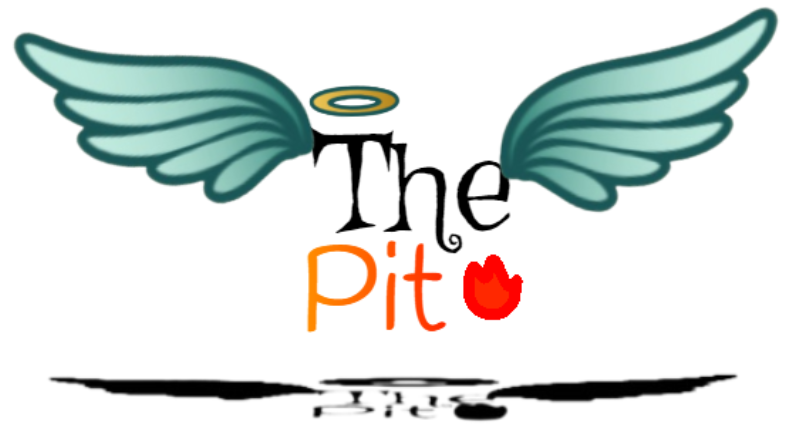

  
*The Pit is a game concept currently, not yet a fleshed-out game.*  
The Pit is a platformer-roguelike where you play in the mind of an overimaginative teen.  
This game incorporates many aspects from my favorite games such as Terraria and The Binding of Isaac.  
The main game is split up into two areas  
**Rogue Rooms** and **Build Rooms**  

Room Types

    
  ### Rogue Rooms  
  Rogue Rooms are typical top-down Zelda-style rooms with enemies and such.  
  ### Build Rooms  
  Build Rooms are 2d Terraria style rooms where there is a parkour area or a puzzle.  
  In these rooms, your weapon turns into a digging tool based on its attributes, and you gain a block inventory.  
  -------------------------------------------------------------------------------------------------------------  

Currently, there are 8 characters (and 2 variants);  
Missingno., *Para***Digm**, The Tattered, Gravita, Amnesiac, Ember, Sam  

 

Characters
 
      Sam  
    Ember  
    Amnesiac  
    Gravita  
    The Tattered  
    ParaDigm
    

